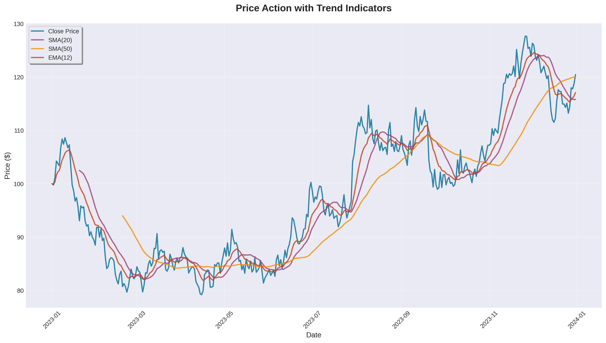
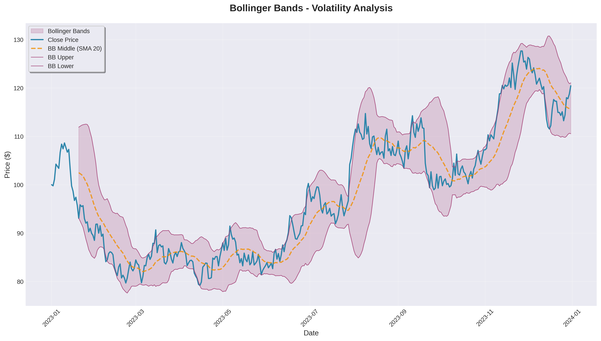
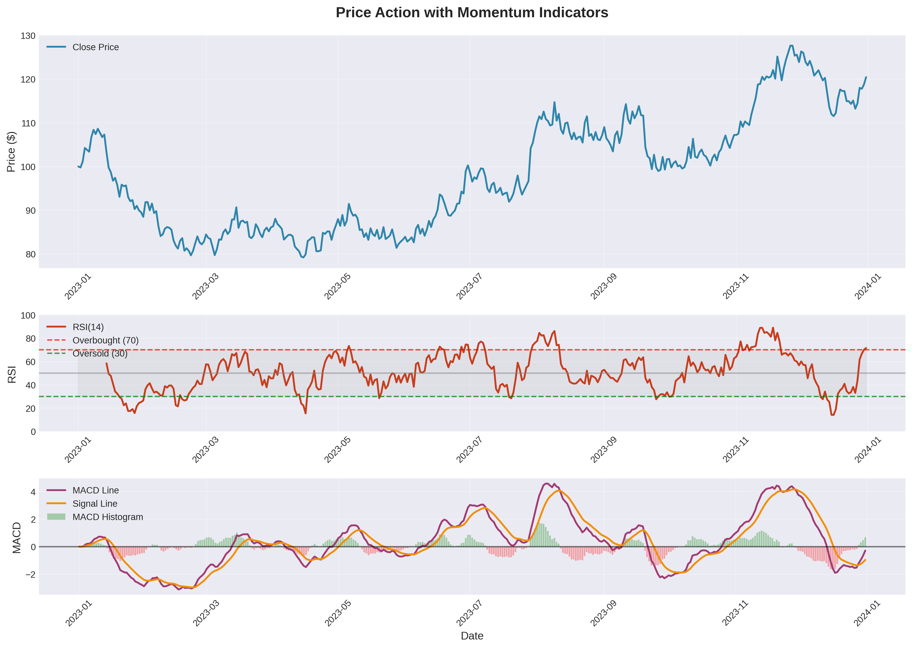

# Polars-Talis 📈

<div align="center">

<a href="https://gosignal.sundaythequant.com/">
  
</a>

**🚀 Powered by [GoSignal](https://gosignal.sundaythequant.com/) - Advanced Trading Intelligence**

[](https://github.com/Physicworld/polars-talis/stargazers)
[](https://github.com/Physicworld/polars-talis/network/members)
[](https://www.python.org/downloads/)
[](https://opensource.org/licenses/MIT)
[](https://pola.rs/)
[](https://badge.fury.io/py/polars-talis-gosignal)

</div>

A high-performance technical analysis library built on top of Polars, designed for financial data analysis with parallel processing capabilities.

## 🌟 Features

- **Lightning Fast**: Built on Polars' optimized DataFrame operations
- **Parallel Processing**: Execute multiple indicators simultaneously 
- **Type Safe**: Full type hints and validation
- **Extensible**: Easy to add custom indicators
- **Memory Efficient**: Leverages Polars' memory optimization
- **Thread Safe**: Concurrent execution without data races

### Available Indicators

#### Trend Indicators
- **SMA** (Simple Moving Average)
- **EMA** (Exponential Moving Average)

#### Momentum Indicators  
- **RSI** (Relative Strength Index)
- **MACD** (Moving Average Convergence Divergence)

#### Volatility Indicators
- **Bollinger Bands**

## 🚀 Installation

```bash
pip install polars-talis
```

Or install from source:

```bash
git clone https://github.com/yourusername/polars-ta.git
cd polars-ta
pip install -e .
```

## 📖 Quick Start

```python
import polars as pl
from polars_talis import TechnicalAnalyzer, SMA, EMA, RSI, MACD, BollingerBands

# Load your data
df = pl.DataFrame({
    "date": ["2023-01-01", "2023-01-02", "2023-01-03"],  # Your dates
    "close": [100.0, 102.5, 101.8],  # Your price data
    "volume": [1000, 1200, 950]  # Your volume data
})

# Create analyzer with multiple indicators
analyzer = TechnicalAnalyzer(max_workers=4)
analyzer.add_indicators([
    SMA(20),           # 20-period Simple Moving Average
    EMA(12),           # 12-period Exponential Moving Average  
    RSI(14),           # 14-period RSI
    MACD(),            # MACD with default parameters
    BollingerBands(20, 2.0)  # 20-period BB with 2 std dev
])

# Calculate all indicators (parallel execution)
result = analyzer.calculate(df, parallel=True)

print(result.columns)
# ['date', 'close', 'volume', 'SMA_20', 'EMA_12', 'RSI_14', 'MACD', 'MACD_signal', 'BB_upper', 'BB_middle', 'BB_lower']
```

## 🔧 Advanced Usage

### Custom Indicator Configuration

```python
from polars_talis import SMA

# Custom column and name
sma_custom = SMA(period=50, column="high", name="SMA_High_50")

# Add to analyzer
analyzer.add_indicator(sma_custom)
```

### Performance Monitoring

```python
# Get summary of configured indicators
summary = analyzer.get_summary()
print(summary)
# {
#     'total_indicators': 5,
#     'by_type': {'trend': 2, 'momentum': 2, 'volatility': 1},
#     'indicators': [...]
# }
```

### Error Handling

```python
try:
    result = analyzer.calculate(df)
except ValueError as e:
    print(f"Data validation error: {e}")
except Exception as e:
    print(f"Calculation error: {e}")
```

## 🏗️ Architecture

Polars-Talis is built with a modular architecture:

```
polars_talis/
├── core/
│   ├── base.py          # Base classes and types
│   └── analyzer.py      # Main analyzer engine
└── indicators/
    ├── trend.py         # Trend indicators
    ├── momentum.py      # Momentum indicators
    └── volatility.py    # Volatility indicators
```

### Key Components

- **BaseIndicator**: Abstract base class for all indicators
- **IndicatorConfig**: Configuration dataclass for indicators
- **TechnicalAnalyzer**: Main engine for parallel indicator execution
- **IndicatorType**: Enumeration of indicator categories

## 📊 Visualizations

Polars-Talis comes with beautiful built-in visualizations to help you understand your technical analysis results:

### 📈 Price Trends with Moving Averages


### 📊 Bollinger Bands Analysis


### ⚡ Momentum Indicators (RSI & MACD)



### Generate Your Own Charts
Run the example script to create these visualizations:

```bash
cd examples
python create_visualizations.py
```

This will generate professional charts showing:
- Price action with trend indicators (SMA, EMA)
- Bollinger Bands volatility analysis  
- Momentum indicators (RSI, MACD) with trading signals

## 🤝 Contributing

We welcome contributions! Please see our [Contributing Guide](CONTRIBUTING.md) for details.

1. Fork the repository
2. Create a feature branch (`git checkout -b feature/amazing-indicator`)
3. Commit your changes (`git commit -m 'Add amazing indicator'`)
4. Push to the branch (`git push origin feature/amazing-indicator`)
5. Open a Pull Request

## 📝 License

This project is licensed under the MIT License - see the [LICENSE](LICENSE) file for details.

## ⭐ Star History

[](https://star-history.com/#Physicworld/polars-talis&Date)

## 🙏 Acknowledgments

- Built on top of the amazing [Polars](https://pola.rs/) library
- Inspired by traditional TA libraries like TA-Lib
- **Powered by GoSignal - Advanced Trading Intelligence** 🚀

---

*For questions, suggestions, or support, please open an issue or contact us through GoSignal.*